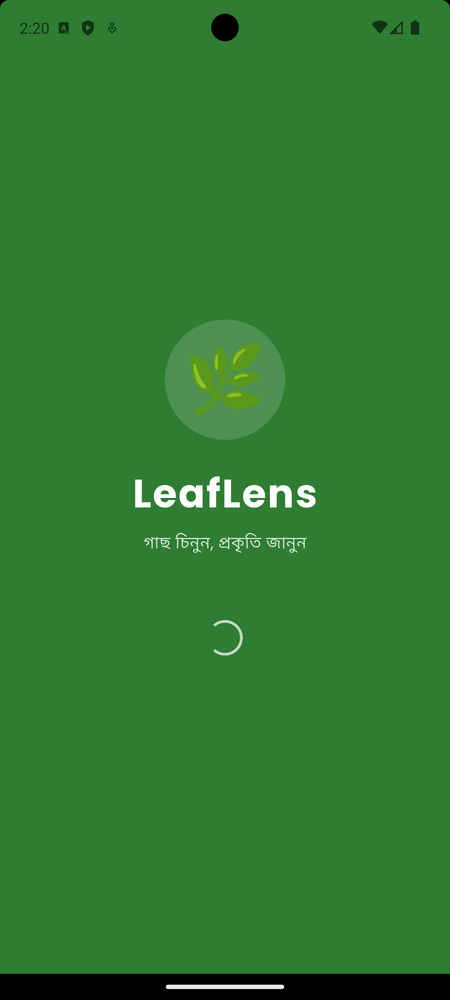
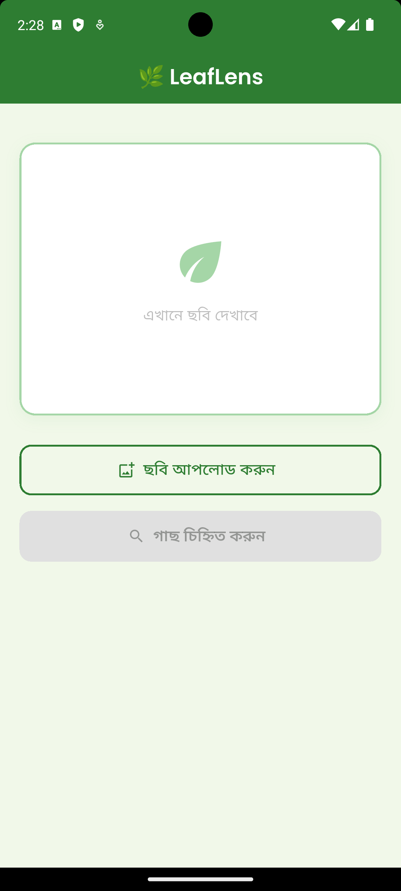
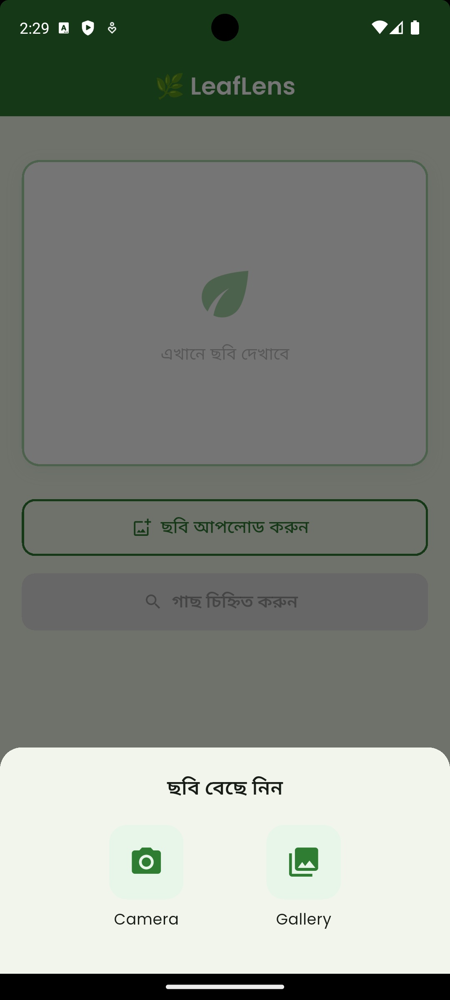
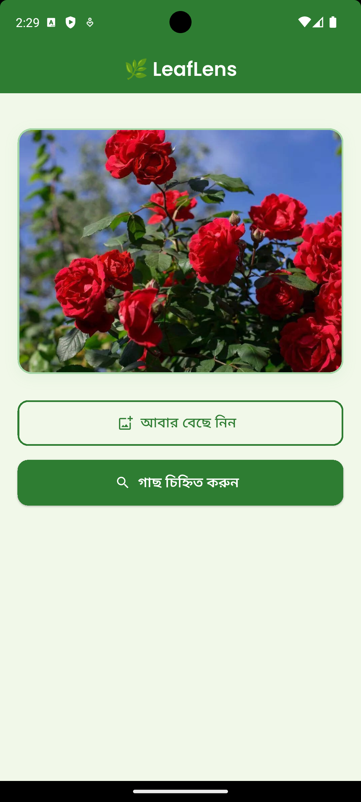
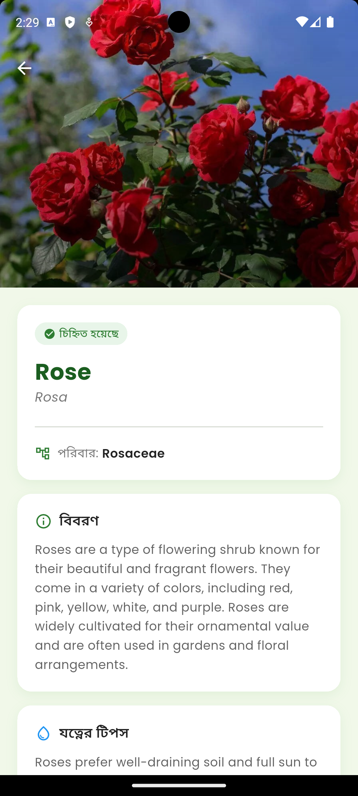
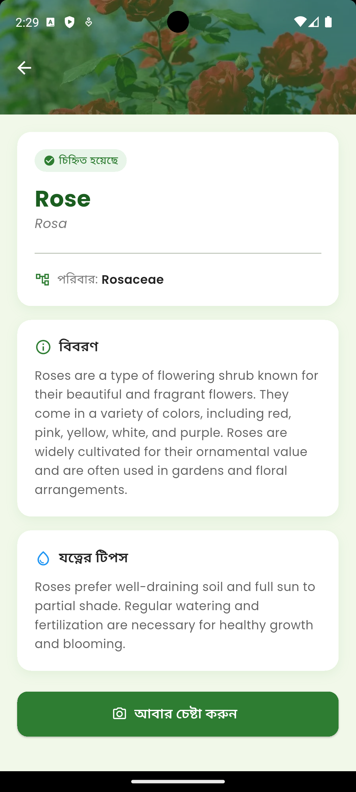
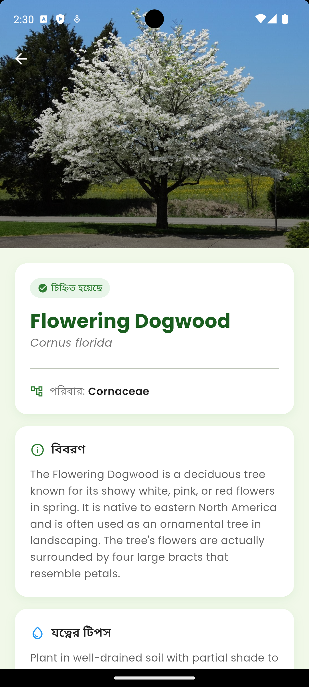
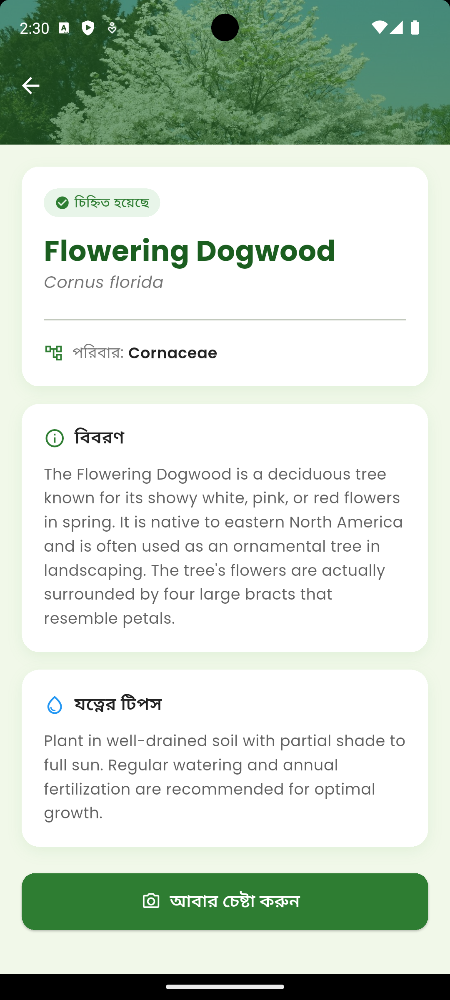

# 🌿 LeafLens — AI Plant Identifier

<p align="center">
  
  
  
  
  
  
  
  
</p>

> An AI-powered Flutter app that identifies plants from photos instantly.
> Just snap or upload a photo — LeafLens tells you everything about the plant!

---

## ✨ Features

- 📷 **Camera & Gallery** — Take a photo or upload from gallery
- 🤖 **AI Identification** — Powered by Groq API + LLaMA Vision
- 🌱 **Plant Details** — Common name, scientific name, family & description
- 💧 **Care Tips** — Basic care advice for identified plants
- ❌ **Smart Error Handling** — Guides user when no plant is detected
- 🎨 **Clean UI** — Green theme with smooth animations

---

## 📱 Screenshots

| Splash | Home | Select Source | Home with Image |
|--------|------|---------------|-----------------|
|  |  |  |  |

| Result | Result Details | More Details | Full Details |
|--------|---------------|--------------|--------------|
|  |  |  |  |

---

## 🛠️ Tech Stack

| Technology | Purpose |
|------------|---------|
| **Flutter** | Cross-platform mobile framework |
| **Dart** | Programming language |
| **Groq API** | AI inference engine |
| **LLaMA 4 Scout Vision** | Image understanding & plant identification |
| **image_picker** | Camera & gallery access |
| **flutter_image_compress** | Image optimization before API call |
| **flutter_dotenv** | Secure API key management |
| **google_fonts** | Poppins typography |

---

## 📂 Project Structure

```
leaf_lens/
├── lib/
│   ├── main.dart                 # App entry point
│   ├── screens/
│   │   ├── splash_screen.dart    # Animated splash screen
│   │   ├── home_screen.dart      # Image picker & main UI
│   │   ├── result_screen.dart    # Plant info display
│   │   └── not_plant_screen.dart # Error & tips screen
│   └── services/
│       └── plant_service.dart    # Groq API integration
├── .env                          # API keys (not in repo)
├── pubspec.yaml
└── README.md
```

---

## 🚀 Getting Started

### Prerequisites
- Flutter SDK >= 3.0.0
- Android Studio / VS Code
- Groq API Key (free)

### Installation

**1. Clone the repository**
```bash
git clone https://github.com/deXT-Sadman/leaf-lens.git
cd leaf-lens
```

**2. Install dependencies**
```bash
flutter pub get
```

**3. Create `.env` file in project root**
```
GROQ_API_KEY=your_groq_api_key_here
```

**4. Run the app**
```bash
flutter run
```

---

## 🔑 API Setup

1. Go to **[console.groq.com](https://console.groq.com)**
2. Sign up with Google
3. Navigate to **API Keys → Create API Key**
4. Paste the key in your `.env` file

> ✅ Groq API is completely **free** — no credit card required!

---

## 📦 Dependencies

```yaml
dependencies:
  flutter:
    sdk: flutter
  image_picker: ^1.1.2
  google_fonts: ^6.2.1
  http: ^1.2.1
  flutter_dotenv: ^5.1.0
  flutter_image_compress: ^2.3.0
```

---

## 🔒 Security

- API key stored in `.env` file
- `.env` added to `.gitignore`
- No sensitive data in repository

---

## 🌱 How It Works

```
User picks image
      ↓
Image compressed (60% quality, max 800px)
      ↓
Converted to Base64
      ↓
Sent to Groq API (LLaMA 4 Vision)
      ↓
AI analyzes & returns JSON
      ↓
App displays plant info
```

---

## 👨‍💻 Developer

**Sadman**
- GitHub: [@deXT-Sadman](https://github.com/deXT-Sadman)
- University: Manarat International University
- Department: Computer Science & Engineering

---

## 📄 License

This project is open source and available under the [MIT License](LICENSE).

---

<p align="center">
  Made with ❤️ and 🌿 by Sadman
</p>